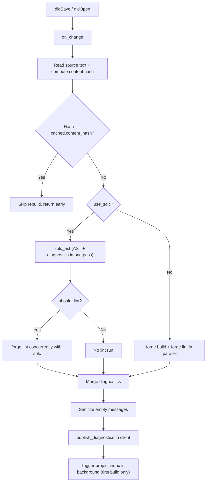

# Diagnostics

## What this page covers

This page describes how the server produces and publishes diagnostics:

- the two diagnostic sources (`solc`/`forge build` and `forge lint`),
- how diagnostics are triggered and published per save,
- the content-hash optimization that skips redundant rebuilds,
- how lint is configured and filtered,
- how non-blocking save was implemented,
- what is covered by tests today.

## Terms used in this page

- **`forge build`**: Foundry's build pipeline; used to get AST + compilation errors when `solc` direct mode is off.
- **`solc`**: direct `solc` invocation used in `--use-solc` mode; produces both AST output and diagnostics in one pass, avoiding a separate `forge build` run.
- **`forge lint`**: Foundry's linter (`forge lint --json`); produces style/best-practice warnings with string codes.
- **`publish_diagnostics`**: the LSP notification sent to the client with the combined diagnostic list.
- **`forge-build` source**: `source` field value for diagnostics coming from the build pipeline.
- **`forge-lint` source**: `source` field value for diagnostics coming from `forge lint`.
- **content hash**: a `u64` hash of the saved file text stored on `CachedBuild`; used to skip redundant rebuilds when the file bytes are identical to the last build.

## Two diagnostic sources

### Source 1: solc / forge build (compilation errors)

Compilation diagnostics come from the Solidity compiler output.

In `--use-solc` mode (default when a compatible `solc` binary is found):

- A single `solc` invocation produces both the AST and the error list.
- Errors are extracted by `build::build_output_to_diagnostics()` from the same JSON output used for AST caching.
- This avoids running `forge build` separately (which can take ~27 s on large projects).

In forge-only mode:

- `compiler.get_build_diagnostics(&uri)` runs `forge build --json` and parses the `errors` array from its output.
- Diagnostics are filtered through `build::ignored_error_code_warning()` which suppresses codes `5574` and `3860` (contract-size / code-size warnings) plus any codes listed in `foundry.toml` `ignored_error_codes`.

Diagnostic fields:
- `source`: `"forge-build"`
- `code`: numeric solc error code (e.g. `2072`)
- `severity`: mapped from solc severity string (`"error"` → `ERROR`, `"warning"` → `WARNING`, `"info"` → `INFORMATION`)

### Source 2: forge lint

Lint diagnostics come from `forge lint --json`.

- `compiler.get_lint_diagnostics(&uri, &lint_settings)` runs `forge lint` and parses the JSON array output.
- `lint::lint_output_to_diagnostics()` maps each entry to an LSP `Diagnostic`:
  - Only the primary span (`is_primary == true`) per diagnostic is used.
  - `source`: `"forge-lint"`
  - `code`: string code from `ForgeLintCode.code` (e.g. `"unused-import"`)
  - `severity`: mapped from `level` (`"error"` → `ERROR`, `"warning"` → `WARNING`, `"note"` → `INFORMATION`, `"help"` → `HINT`)
  - Empty `message` fields fall back to `rendered`, then `span.label`, then `"Lint warning"` to avoid crashing clients that require non-empty messages.
- Post-run filtering applies: codes listed in `lint.exclude` (editor settings) are removed from the result.

## Runtime flow

Diagnostics are produced in `on_change`, which is called from both `did_save` and `did_open`:

## Content-hash optimization

Before running any compiler, `on_change` computes a `u64` hash of the saved text using `DefaultHasher`. If the hash matches `CachedBuild.content_hash` from the last successful build, the save is a no-op — no solc/forge invocation, no diagnostic publish. This prevents redundant rebuilds in format-on-save loops where a formatter applies edits, the editor saves again, and the resulting bytes are identical to the previous build.

The hash is stored on `CachedBuild` after each successful build and reset to `0` when the cache is invalidated.

## Non-blocking save

`did_save` delegates work to a background task via `tokio::task::spawn_blocking` for CPU-heavy blocking operations:

- `collect_import_pragmas` (recursive FS crawl over imported files) runs on the blocking thread pool, not on the async runtime thread. This prevents the async executor from stalling on large projects (~95-file crawls).
- The AST save path and diagnostics publish happen on the async runtime after all blocking work is complete.

## Lint configuration

Lint behavior is controlled by two layers:

1. **`foundry.toml`** (`lint.exclude`, `lint.severity`, etc.) — read at startup and when the workspace config changes.
2. **Editor settings** (`settings.lint.*`):
   - `lint.enabled` — master toggle; set to `false` to disable all lint diagnostics.
   - `lint.severity` — `["high", "med", "gas"]` maps to `forge lint --severity` flags.
   - `lint.only` — maps to `forge lint --only-lint`.
   - `lint.exclude` — codes filtered after `forge lint` returns (client-side filtering).

`lint_config.should_lint(&file_path)` returns `false` for files outside the project root or in `lib/` (dependencies), so third-party code never produces lint diagnostics.

## Diagnostic sanitization

Before publishing, all diagnostics (regardless of source) have their `message` field checked. Any empty `message` is replaced with `"Unknown issue"`. This prevents crashes in LSP clients (e.g. trunk.io) that require non-empty diagnostic messages.

## Main implementation files

| File | Role |
|------|------|
| `src/lsp.rs` | `on_change` — orchestrates build + lint, hash check, publish |
| `src/build.rs` | `build_output_to_diagnostics`, `ignored_error_code_warning` |
| `src/lint.rs` | `lint_output_to_diagnostics`, `ForgeDiagnostic` types |
| `src/solc.rs` | `solc_ast` — combined AST + diagnostics in single invocation |
| `src/config.rs` | `LintSettings`, `LintConfig`, `should_lint` |

## Test coverage and confidence

`src/build.rs` and `src/lint.rs` have unit tests covering:

- `ignored_error_code_warning` suppresses codes `5574` and `3860` by default.
- `source_location_matches` correctly matches both absolute and relative forge error paths.
- `lint_output_to_diagnostics` parses a known fixture into the expected `Diagnostic` shape.

### Recommended explicit additions

- Integration test through `on_change`: assert that saving a file with identical bytes skips a rebuild (content-hash short-circuit).
- End-to-end test: inject a solc error output fixture and assert `publish_diagnostics` is called with the expected `Diagnostic` list.
- Test that `lint.exclude` correctly filters out specified string codes after `forge lint` returns.
